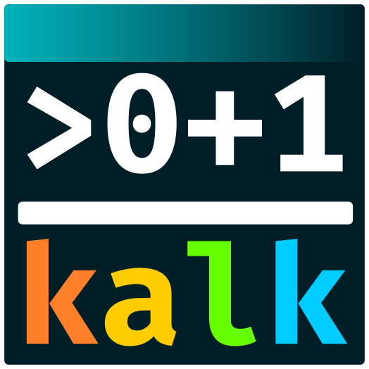

# kalk

This is the repository of [kalk](https://kalk.dev), a powerful command line **calculator app** for developers.

## Supported Platforms

- Windows x64
- Linux x64 (Debian derivatives - e.g Ubuntu and Redhat)
- macOS

## Download

Visit the [Download](https://kalk.dev/download) section.

## License

This software is released under the [BSD-Clause 2 license](https://opensource.org/licenses/BSD-2-Clause). 

## Author

Alexandre Mutel aka [xoofx](http://xoofx.com).