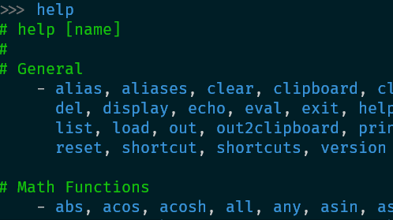

    

    <h1>kalk - calculator</h1>
    
A powerful command-line calculator application for developers!
 
    

    

{{CALLOUT class:'alert show fade' do}}
<button type="button" class="close" data-dismiss="alert" aria-label="Close">x</button>

`kalk` just launched and is available as a preview, [try it out](download.md)! If you have any feedback, please log them [here]({{site.github_repo_url}}/issues/new) on GitHub <i class="fa fa-heart-o"></i>
{{end}}

    

    <h3><i class="fa fa-bolt kalk-color-0"></i>Built-in Functions</h3>
    

1000+ functions with a powerful language to automate 
your calculations. Many functions are similar to the shading HLSL language.

    <h3><i class="fa fa-magic kalk-color-1"></i>Enhanced Experience</h3>
    

Enhanced user experience with syntax highlighting,
cursor on error, braces matching, keyboard shortcuts (e.g text select, moving cursors by word...).

    <h3><i class="fa fa-cogs kalk-color-2"></i>Developer Mode</h3>
    

Use the developer mode to get more details about your floating point
numbers or to get hexadecimal equivalent representation.

    <h3><i class="fa fa-h-square kalk-color-3"></i>Hardware Intrinsics</h3>
    

Use [Intel Hardware Intrinsics](/doc/api/intel/readme.md) (from SSE to AVX2) or [ARM Hardware intrinsics](/doc/api/arm/readme.md) (Neon, ARM64...), easily accessible as functions.
Easily bitcast results between vector types or test memory read/write.

    <h3><i class="fa fa-book kalk-color-0"></i>Integrated Help</h3>
    

Documentation of all functions is fully integrated in the app. Just type `help` to
get more information.

    <h3><i class="fa fa-th kalk-color-1"></i>Modules</h3>
    

Modules are a great way to extend the basic calculator experience: `Strings`,
`Web`, `Currencies`, `StandardUnits`...

    

